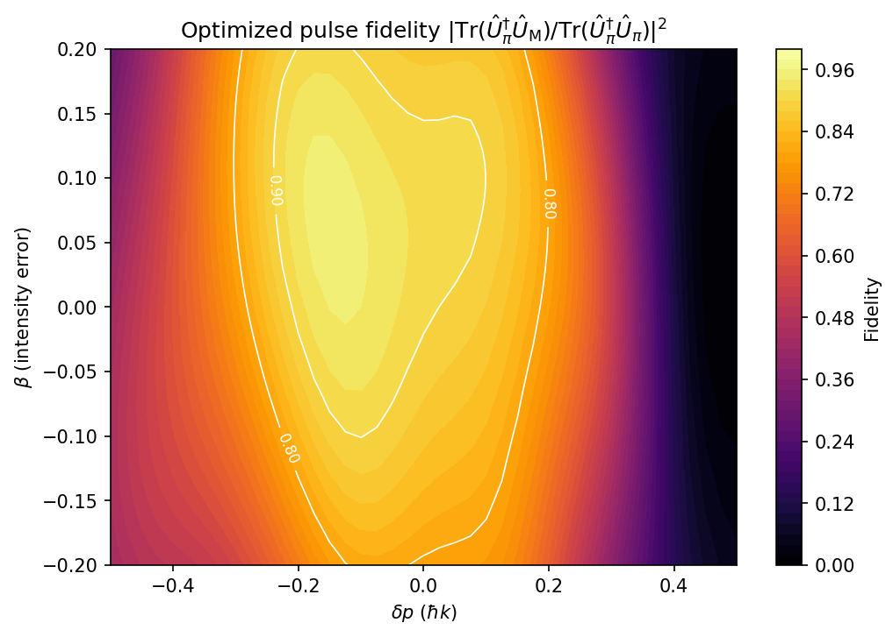
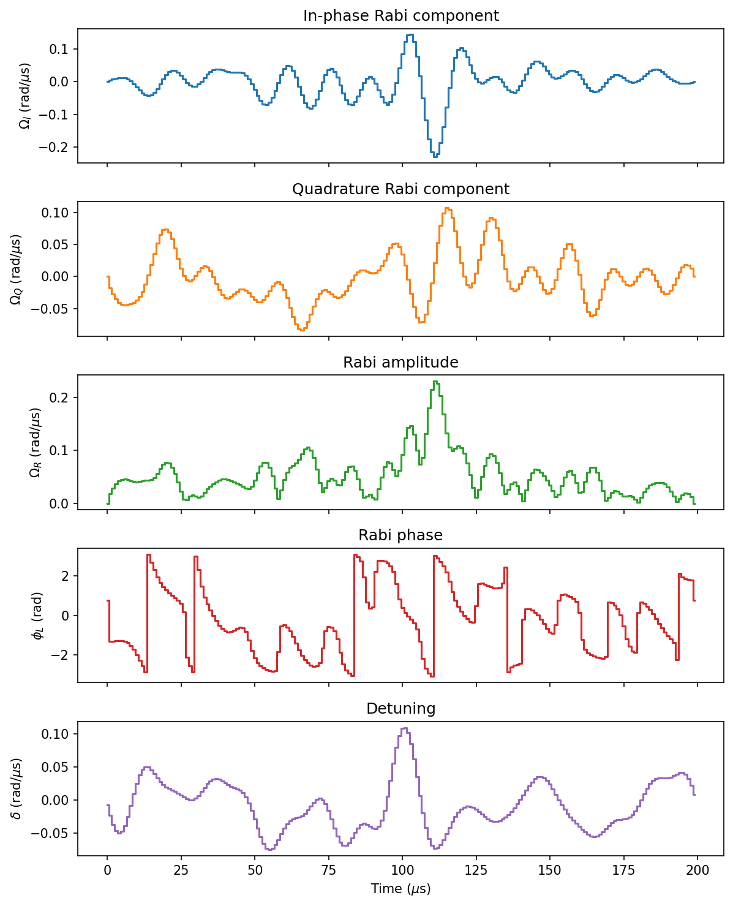

# pi-pulse

Numerical optimizer for pi (mirror) pulses in large-momentum-transfer (LMT) atom interferometry, based on [Saywell et al., *Nature Communications* (2023)](https://www.nature.com/articles/s41467-023-43374-0).

Given a Bragg diffraction order *n*, the optimizer finds piecewise-constant laser control sequences (Rabi drive + detuning) that maximize the mirror fidelity of a 2*n*&#8463;*k* momentum transfer, averaged over realistic distributions of atomic momentum spread and laser intensity noise.

<p align="center">
  
</p>

## Example Output (500 Iterations)

Script parameter settings

| Parameter | Value | Description |
|---|---|---|
| `N_MIRROR` | 3 | Bragg order (6&#8463;*k* transfer) |
| `N_PULSE_STEPS` | 200 | Number of piecewise-constant time steps |
| `DT_PULSE` | 1 &mu;s | Duration of each time step |
| `OMEGA_MAX` | 2&pi; &times; 40 kHz | Peak Rabi frequency |
| `SINC_CUTOFF_KHZ` | 80 kHz | Low-pass filter bandwidth |
| `sigma_p` | 0.15 &#8463;*k* | Momentum spread (Gaussian &sigma;) |
| `beta_min, beta_max` | &pm;0.15 | Intensity error range (uniform) |
| `batch_size` | 256 | Noise samples per iteration |
| `num_epochs` | 500 | Optimization iterations |
| `lr` | 0.001 | Adam optimizer learning rate |

<p align="center">
  
</p>

## How it works

1. Initialize random control sequences for &Omega;<sub>I</sub>, &Omega;<sub>Q</sub>, and &delta;
2. Each iteration, draw a batch of noise samples:
   - Momentum spread &delta;*p* ~ N(0, &sigma;<sub>p</sub>)
   - Intensity error &beta; ~ U(&beta;<sub>min</sub>, &beta;<sub>max</sub>)
3. Build the full time-dependent Hamiltonian for all samples (vectorized over the batch)
4. Chain-multiply matrix exponentials to get the total propagator *U*
5. Compute the batch-averaged mirror infidelity and backpropagate through PyTorch autograd
6. Adam optimizer step, followed by projection onto constraints:
   - Sinc low-pass filter (bandwidth limit)
   - Amplitude clamp (&Omega;<sub>R</sub> &le; &Omega;<sub>max</sub>)
   - Zero boundary conditions
7. Save the best pulse and generate evaluation plots

## Project structure

```
main.py         - Entry point: defines parameters, runs the optimization loop
physics.py      - MirrorPropagator class (Hamiltonian construction, propagator, loss)
                  and constraint projection (sinc filter, amplitude clamp)
evaluation.py   - Post-optimization evaluation: fidelity grid, parameter plots,
                  fidelity contour maps
utils.py        - Device selection (CUDA/MPS/CPU) and pulse saving (.npz)
const.py        - Physical constants (87Rb mass, recoil frequency, laser wavenumber)
```

## Setup

Requires Python 3.13.

A `pyproject.toml` (Poetry configuration file) is included for dependency management. 

Install [Poetry](https://python-poetry.org/)
```bash
pipx install poetry
```

To create a virtual environment in the project directory run:
```bash
cd /path/to/project/folder
python3.13 -m venv .venv
```

Activate the virtual environment:
```bash
source .venv/bin/activate
```

install dependencies

```bash
poetry lock
poetry install
```

A CUDA-capable NVIDIA GPU is strongly recommended for good performance.

The optimizer uses 64-bit floating point precision (`float64`). Because of this, Apple Silicon GPUs (MPS backend) are not supported.

## Usage
`main.py` script runs optimizer to find pulse parameters.

## Reference

Saywell *et al.*, *Nature Communications* (2023). https://doi.org/10.1038/s41467-023-43374-0
